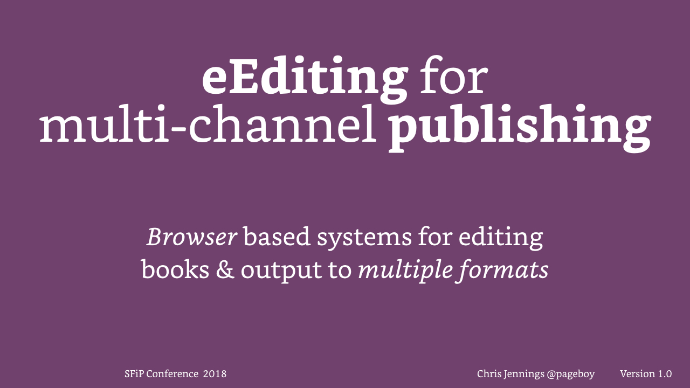

### Browser based systems for editing books and output to multiple formats

I explore editing systems where the content is actually stored (much like blogging content) on a remote server.

This presentation was given at the _SfEP_ conference at Lancaster University, September 2018.

[Here is the presentation as PDF >](../media/keynotes/eEditing%20in%20the%20Browser.pdf)
