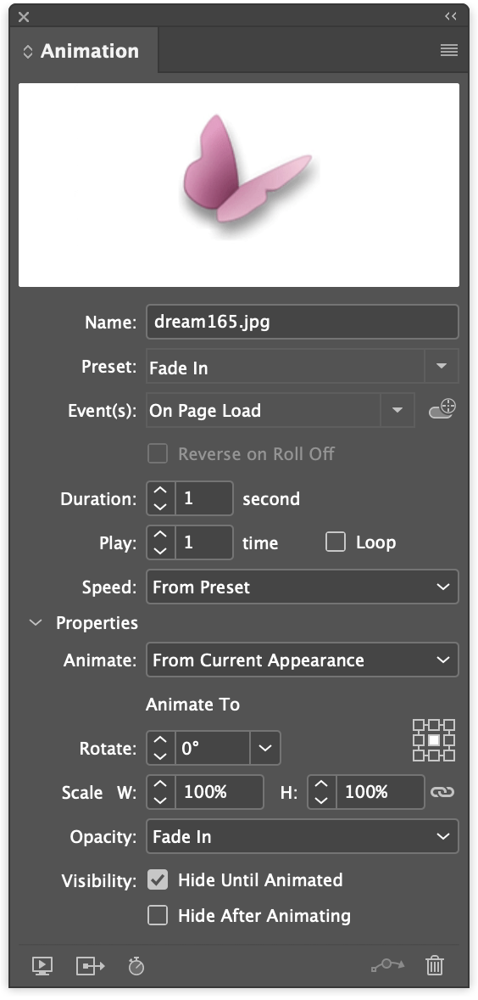
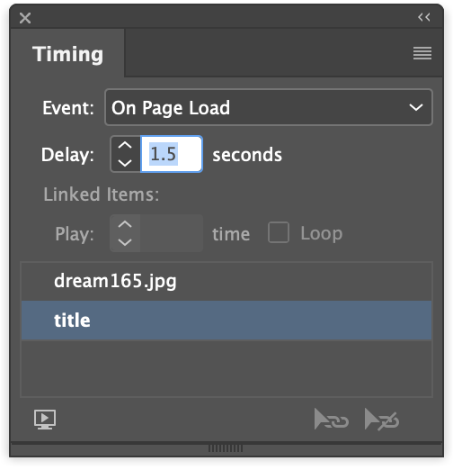

---
hide:
 - navigation
tags:
 - ebookproduction
 - indesign
 - epub
---

## Enhancements to the eBook

> … enhancements added to the book to make a compelling interactive experience? Do the interactions and dynamic qualities add value to the eBook?

The more enhancements the better!

### Page transitions
Objects on the page can appear through an animation. One or more objects can be allocated an animation preset and then be set to be invoked on _page load_.

If you want to animate multiple objects then you can use the _Timing Panel_ to organize the sequence and delays etc.

### Image enlargement with animation
Rather just have an image popup over the smaller view, large versions can arrive by fading or moving on to the page.

#### Extending the image with Effects

if the image that is to be enlarged does not cover the screen (if it is portrait), then we can extend the graphics area by using _effects_ and then adding an _outer glow_. This will then cover over the other items on the screen but also extend the active button area so as to make the object hide on click/touch.

## Coming soon
### Audio

- Ambient sound
- Music on demand
- Audio clips

Sound control / buttons for play and pause

### Video
Video must be mp4. No YouTube links allowed

Can be enlarged so can be small within the text

