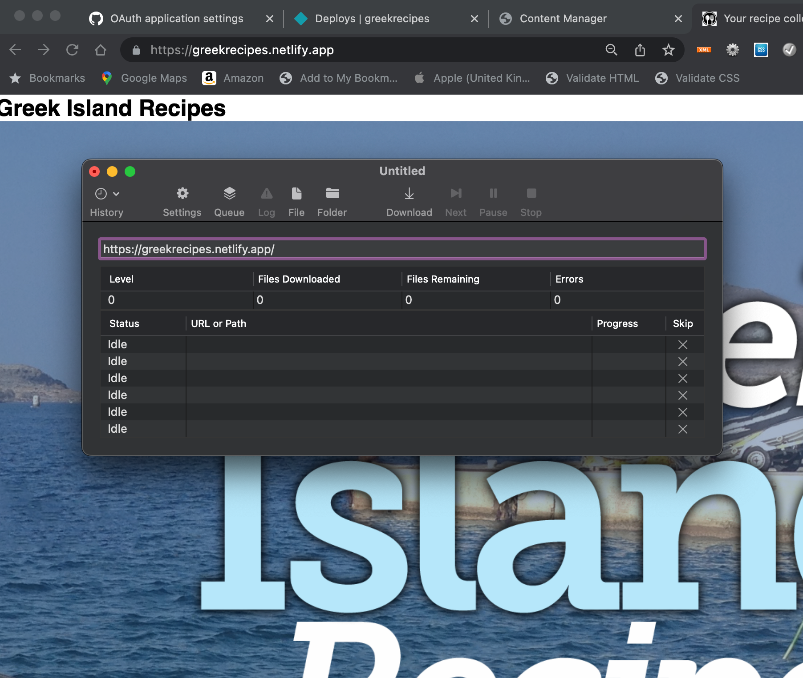

## From the CMS to web
### the process

with all (or most) of the content edited in the CMS:

use *sitesucker* to download the complete live web site to your computer (or google drive project space)

- Open the folder in vscode 
- edit the CSS (not the HTML)
- review the site offline and when happy

- paste ONLY the CSS back to the GitHub repository

You can also edit the `_config.yaml`  file and change the menu to be true. This will produce a menu of of all recipes on each recipe page for easy navigation between recipes.

After styling this _could_ look like this:

