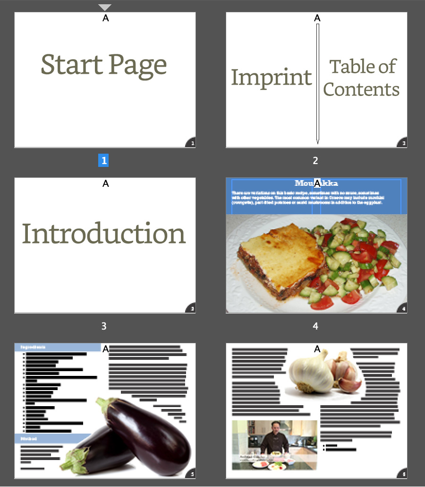

---
hide:
 - navigation
tags:
 - digitalproduct
---

This week we need to add the frontmatter pages. 

## The new pages needed:

A page that starts the book. This will be a landscape page that can be a version of the cover, with the title and subtitle and image.

Then we need the imprint or copyright information. You can split this page into 2 with the imprint on the left and the table of contents on the right.

When constructing the start page, keep the elements separate so that we can make this page deliver dynamically with a build up.

> [!help] 
>  More details on the Table of contents is available here although the examples given are for a portrait shaped book.
>  [Building the TOC in InDesign](../../Articles/Building%20the%20TOC%20in%20InDesign.md)

