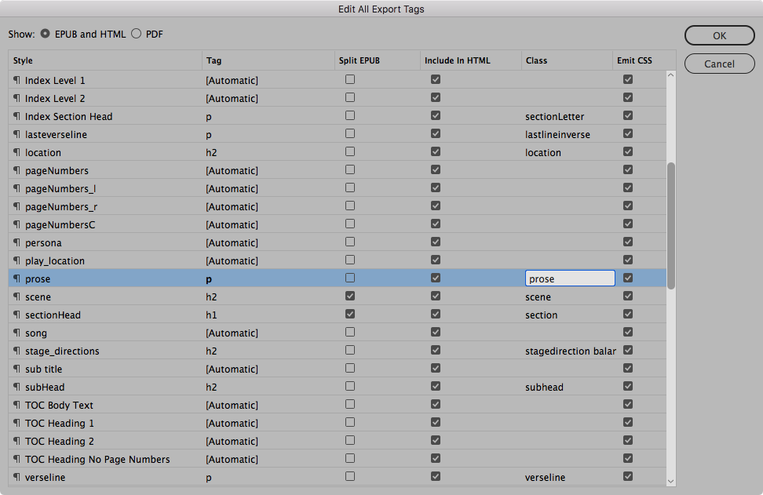
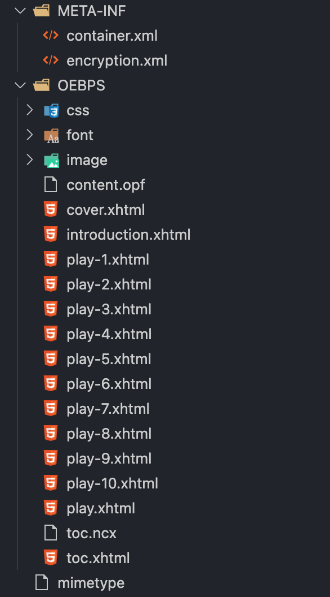

---
hide:
 - navigation
tags:
 - ebookproduction
 - indesign
---

Any questions or issues or any reminders needed?

## Points to make
We are letting InDesign do most of the work but we have control of the tagging (and class names) that get created on export. We do this through the `Export tagging`



### Why should we care about the tagging and class names?

If we know the names of the tags and class names of the HTML selectors, then we can potentially modify the styles within the eBook by editing our own CSS file.

### What is this CSS file and how do we create it?

In our project we do have one that is available (as a starting point) [we can find it here in this `gist`](https://gist.github.com/Pageboy/731b9b7ad8e42c324dc75528f159ad98) 

>However, we can make our own by copying the main one that InDesign creates. **How?**

- Unpack the ePub created from the InDesign export - we use [eCanCrusher](https://www.docdataflow.com/ecancrusher/) to do this
- Open the folder with [vscode](https://code.visualstudio.com/download) and locate the file called `idGeneratedStyles_0.css`
- we can duplicate this file as something like `eplay.css`
- in this CSS we can modify the rules within the selectors; these will then overwrite the InDesign at export time
- we do need to select this new CSS file at export time


> [!note]
> there is a more substantial document about this here
>  [Editing inside the ePUB package](../../../eBookProduction/Editing%20inside%20the%20ePUB%20package.md)

### Roundtrip
By having our own CSS file and _only_ editing this file, we can go back to InDesign and make changes as long as we don't make new styles or change the export tagging for the ePub.

Although we can edit the HTML inside the ePub (after unpacking), we should avoid this, otherwise we cannot easily go back to InDesign for further work.

Here we see how the CSS files are added to the HTML (inside the head of the page)

```html
<link href="css/idGeneratedStyles_0.css" rel="stylesheet" type="text/css" />
<link href="css/idGeneratedStyles_2.css" rel="stylesheet" type="text/css" />
<link href="css/eplay.css" rel="stylesheet" type="text/css" />
```

Our own `eplay.css` is added _after_ the InDesign generated ones.

## What does the ePub consist of?
Here are the files inside the ePub



### Particulars
#### content.opf

This is both a configuraion file and a `manifest` that references all content inside the ePub package. There is metadata about the ePub in here also.

```xml
<metadata xmlns:dc="http://purl.org/dc/elements/1.1/">
		<meta name="generator" content="Adobe InDesign 17.1" />
		<meta name="cover" content="msnd_cover.png" />
		<meta property="ibooks:specified-fonts">true</meta>
		<dc:title>A Midsummer Night&#39;s Dream</dc:title>
		<dc:creator>Shakespeare</dc:creator>
		<dc:date>2022-03-03T16:54:45Z</dc:date>
		<dc:language>en-GB</dc:language>
		<meta property="dcterms:modified">2022-03-03T16:54:45Z</meta>
		<dc:identifier id="bookid">urn:uuid:861833BD-B162-427E-BF13-185185EC8530</dc:identifier>
	</metadata>

```

The manifest part of the file may be very long so I won't include all here

```xml
<manifest>
		<item id="cover" href="cover.xhtml" media-type="application/xhtml+xml" />
		<item id="introduction" href="introduction.xhtml" media-type="application/xhtml+xml" />
		<item id="play" href="play.xhtml" media-type="application/xhtml+xml" />
		<item id="play-1" href="play-1.xhtml" media-type="application/xhtml+xml" />
	
	.......
</manifest>
```

and then we have spine section which determines the order:

```xml
<spine toc="ncx">
		<itemref idref="cover" linear="no" />
		<itemref idref="introduction" />
		<itemref idref="play" />
		<itemref idref="play-1" />
		<itemref idref="play-2" />
		<itemref idref="play-3" />
		<itemref idref="play-4" />
		<itemref idref="play-5" />
		<itemref idref="play-6" />
		<itemref idref="play-7" />
		<itemref idref="play-8" />
		<itemref idref="play-9" />
		<itemref idref="play-10" />
</spine>
```

The complete content.opf file looks like this: [[week7extras/ePub_content_opf]]

#### The table of Contents file(s)
There are 2 of these:

the toc.ncx file id for backwards compatabilty for older devices and readers that only support the ePub (version 2).

It looks like this:

[ePUB_toc_ncx](week7extras/ePUB_toc_ncx.md)

The better toc that is used by the ePub3 reader is more conformant to `xhtml`. 

This one looks like this:

[ePub_toc_xhtml](week7extras/ePub_toc_xhtml.md)

>These files should not be edited, however if there is a problem with the table of contents one could edit this as a last resort, noting that this will upset the _roundtrip_ to InDesign as mentioned before.

### The guide section of the content.opf

The guide section in the content.opf file is not officially needed for the ePub3 package and it’s function is replaced by the `landmarks` section of the navigation document (toc.xhtml)

### The landmarks section

```html
<nav epub:type="landmarks">
	<h2>Landmarks</h2>
		<ol>
			<li><a epub:type="cover" href="cover.xhtml">Cover</a></li>
		</ol>
</nav>

```

The landmarks section is generated from InDesign at export time and the elements within should come from the export options settings. However, I don’t believe that this functions properly.

If you add the following to one of the items in the Landmarks section, the eBook will open on that page:

`epub:type="ibooks:reader-start-page"`

This is from the specific iBooks vocabulary and will only make a difference on Apple devices if you add the following attribute to the HTML tag at the top of the toc.xhtml page:

```html
<html xmlns="http://www.w3.org/1999/xhtml" xmlns:epub="http://www.idpf.org/2007/ops" epub:prefix="ibooks: http://vocabulary.itunes.apple.com/rdf/ibooks/vocabulary-extensions-1.0/">
```

### eReaders

By this I mean the software that shows the eBook. There are a number for computers (Mac and PC). By default, if you have a MAC your will have Apple Books. If you want an alternative, then I suggest [Thorium (free download) from here](https://www.edrlab.org/software/thorium-reader/). This works on both MAC and PC. Another one is [Adobe Digital Editions](https://www.adobe.com/uk/solutions/ebook/digital-editions/download.html) (also free) for both MAC and PC.

You can email the ePub file to yourself and open on your Phone or tablet. On iOS you have Apple Books, other devices have their own. If you have a Kindle, you can also get the eBook there, but you may need to do this via a cable.

There is a very comprehensive help document available here.

[Creating a Reflowable eBook after a print production workflow](../../eBookProduction/Creating%20a%20Reflowable%20eBook%20after%20a%20print%20production%20workflow.md)
