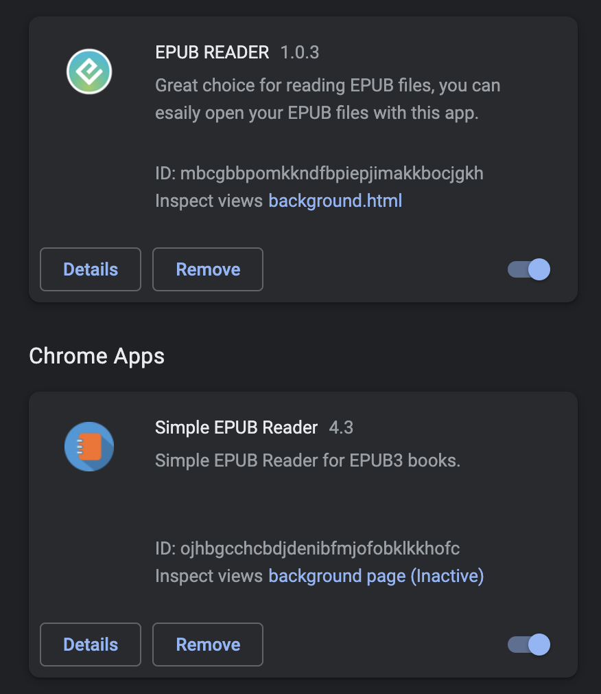

---
hide:
 - navigation
---

I am writing this list because I am disappointed with Apple Books that has been updated for the MacOs version called Monterey. Apple Books has become a ‘catalyst’ app, meaning that it is the same on both MACOS and iOS. 

**The proofing tool has gone!**

The best alternative reader (for all platforms) is [Thorium available for free here](https://www.edrlab.org/software/thorium-reader/).

Adobe have also [Digital Editions which can be downloaded here](https://www.adobe.com/uk/solutions/ebook/digital-editions/download.html).
The engine that drive Adobe Digital Editions is also used on various tablets such as Kobo and other Android based devices.

Aldiko (iOS and Android)

[Kobo](https://www.kobo.com/gb/en/p/apps)

Another way to read eBooks is in the web browser. Google Chrome has a few as extensions. Just search for eBook reader.

