---
tags:
  - css
  - multiplatform
date: 2025-02-16
updated: 2025-02-24
title: Creating a Reflowable eBook
---

This work follows on from previous workflows in creating a Shakespeare play for print. We should already have an Indesign ‘book’ with at least 2 sections. We will export from InDesign for ePub (re-flowable) and then 'break open' the ePub file and make some changes to some of the included files.

- You will need to be using Photoshop to edit the cover image and edit the pictures and add the metadata.
- You will need to be using InDesign Creative Cloud (2017). The screen grabs in this document are created from InDesign version 12
- You may need to edit the ePub file after export from InDesign and I suggest Atom. In order to edit the ePub package, you will need to ‘unpack’ the file and then re-pack. A script is available for this.

### Prepare

You should keep the original versions the InDesign files and book that you have used the create the print version. We may need to make modifications to the InDesign files, so I suggest that you archive the original work that you have used for the print version. We are, effectively _forking_ to a new version of the book.

## The Content

For my example I am working on ‘A Midsummer Night’s Dream’. I have already created a version of my book ready for print. It has the following components.

- The Cover (I need to extract the front from the complete jacket previously designed).
- A half title page (I will abandon this in the eBook)
- A copyright page
- A Title page
- A Table of contents
- The Introduction
- The Dramatis Personae
- The Play

Here is a sample double page spread from the print -ready PDF of my book.

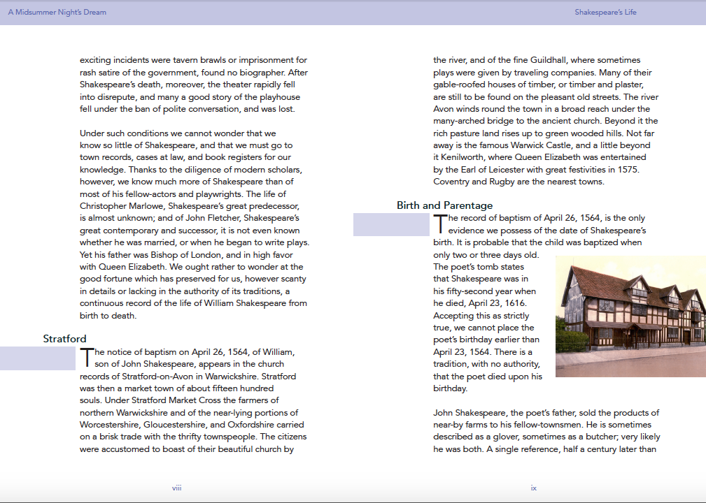

We will export the ePub (re-flowable) from InDesign, but first there are several things we must consider and modify before we are ready to export.

### Illustrations

You will want to illustrate your Shakespeare Play, so you need to gather the images in your images folder described above. The plan is to have at least one image for each scene of the play.

You will want to make some adjustments to these images using Photoshop perhaps. The images should be large enough to display in good quality within the eBook. They should be no smaller than 1000pixels wide in 72 PPI. InDesign will create the appropriate format for the eBook later, but, for now you are gathering your assets (text and images) and considering the structure of your eBook and how the play should display.

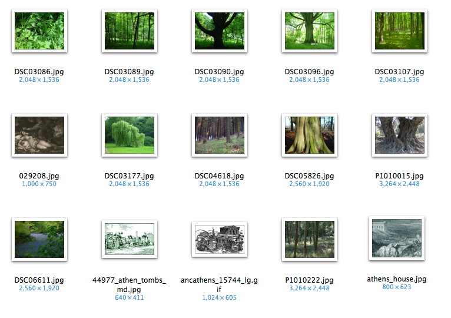

### Back to Work

The presumption is that you have used the book panel to manage your individual InDesign documents as a collection, so go ahead and open the book panel and view the first of your InDesign sections.

We now need to address the various aspects of our previous work and how this will be affected when we export to the re-flowable ePub format.

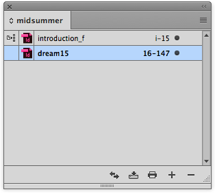

### The Page

The page size in my example is (portrait), 164mm x 234mm. This was set up for print and this is a physical dimension. If we were creating an eBook from scratch with no intention to make a print version, then we might use pixel dimensions. However, the print size will not effect the way the eBook is exported, but if we want to get a better idea of how the eBook will look while we are working with InDesign, then having deep margins and single pages rather than spreads is an advantage. When you get more experienced with eBook production, you should be able to work for the print and eBook versions within the same InDesign document. Creating print and eBooks from the same InDesign document is the ultimate goal—some might even say the ‘Holy Grail’!

As you will see, it is often the case that we will need to modify some attributes of the InDesign document to get a better eBook result. For this reason, we tend to ‘fork’ a new version specifically for the eBook edition.

### Spreads

Although we may have our InDesign set up as spreads, we have no absolute control over the recto and verso pages in a re-flowable eBook. In fact we should avoid using those terms since they indicate front and back of the paper, rather than left and right!

Some eBook reader software does provide a double spread view, and some tablets will automatically give you a left and right view when the tablet is used in a landscape/horizontal mode, but these left and right pages may not be the same that you see in the print version of the book.

If our book design depends on the spread view; with images that cross over the spine, or images that bleed right to the edge then we should consider using the fixed-layout eBook format. In this book we are focussing entirely on the reflowable format and the many challenges that we face in getting beautifully designed responsive eBooks. We may need to make compromises but we intend to keep them to a minimum.

## Margins and Bleeds
Different eBook reader software and devices already provide margins, and some even allow the user to adjust these margins, so your settings may be irrelevant to the eBook.

With a [^1]re-flowable eBook, there is no way that we can take content right to the edge of the screen. There will always be a margin. Content that goes to the edge for our print version, will be cropped or moved.

## Colour

In a printed book, colour costs money. An eBook does not have that constraint, and so you might consider using colour in your text. You may use colours for the headings or to give emphasis here and there. You should create the swatches for the colours that you will need. Perhaps you could take colour ideas from the cover that you already created.

You should not overuse colour. It is always best to use a limited palette; be consistent and remember, readability is crucial, so good contrast between text and background is essential.

### CMYK or RGB?
Where print ready PDFs need to have colour set for the process inks (cyan, magenta, yellow and black `CMYK`), eBooks need colour in RGB (red, green and blue). When we export to the ePub format, the colour mode will be transformed automatically. CMYK will become RGB.

If you use colour in the text, then I suggest that you define the colour with RGB values directly, because you will get a better result than if you leave InDesign to make the conversion. Previously, we insisted that colour images for our print version should be in CMYK mode. If this is how your images are set up in the InDesign document, then all will be well when you export to the ePub.

If you are adding images specifically for the eBook version, then they can be left in RGB mode.

## Paragraph and Character Styles
You will already have set up paragraph and character styles for the print production version. It is important that you use styles for every aspect of the typographic design and avoid where possible, overriding text formats.

There are now some very specific details that we need to address for good output to the re-flowable ePub format.

### Styles become HTML and CSS in the ePub
When we export to the ePub format, the paragraph and character styles will be resolved into a combination of markup in the HTML and stylesheet definitions in the CSS. We have control over this output by using the Export Tagging section of the style panel.

### Styles for the Headings
You will notice in the example here that the beginning of the ACT and the beginning of the SCENE in each case begins on a new recto page. This is because I have selected ‘On the Next Odd page’ under the keep options for this style rule. This forces this heading style to move to the top of the next facing page. We used this style setting for our print book.

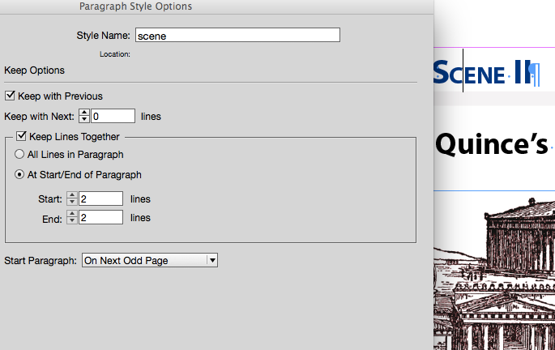
You will need to think carefully about how you want the headings to appear. Do you want to start the ACT at the top of a page? Will the Scene also start a new page, or only when it come after the first scene?

This is an important concept in InDesign, and we would normally use this feature for printable documents. In our ePub though we will need to apply some other settings before we export to ePub. Controlling where pages begin is a challenge. Controlling where pages end is virtually impossible.

## Export Tagging

You need to pay special attention to the Export Tagging panel because it will help you get a successful ePub. Do not rely on InDesign to create the markup for you. Choose the tag and give each a class name. Class names are without spaces, however a tag can have more than one class name by entering a single space between them.

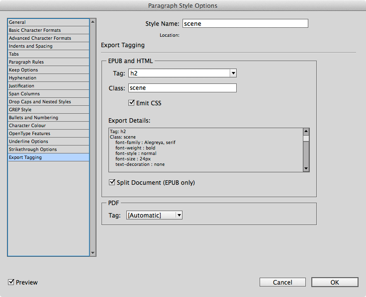

### Splitting for the ePub
The final attribute panel in the paragraph panel is ‘Export Tagging’. This is where we tell InDesign what HTML tag to use in the ePub file. We also need to consider if our heading is an appropriate place to ‘Split the ePub’ and how this relates to our table of contents.

It is important that we use the correct level tags; h1 through to h6 for the headings but p for the paragraphs.

## Placing Images

Images will need to be anchored in the text, so that when the text flows (when the reader has increased the font size), the image stays with the correct text. Images that are not anchored may simply appear at the end of the ebook.

The important thing to remember, is that this process is more about the flow of the document rather than the appearance, so we cannot just place the images anywhere and expect them to appear in the right place within the text. The images need to be 'anchored' correctly.

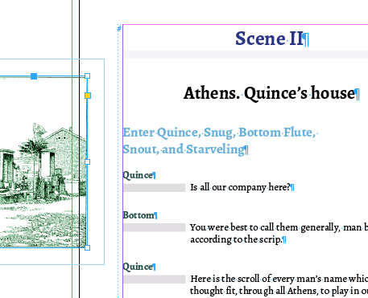

### Anchoring Images

In my eBook I plan to put a different images with each scene. I intend to place this image below the Scene heading and before the start of the first stage directions.

Here we see the image on the pasteboard. Notice the small blue square on the border of the image. We need to shift-drag this to the end of the line ‘Athens. Quince’s House’. This will anchor it at this point in the text and you should notice an ‘anchor’ symbol in place of the small blue square.


Now we need to create an Object Style for all images that will follow the scene title.

## Object Styles
Object styles are a very powerful feature of InDesign, and allow you to apply formatting to various attributes of the object.

With the anchored image selected, find the Object panel, and create a new object style. I will name mine ‘scene\_image’.

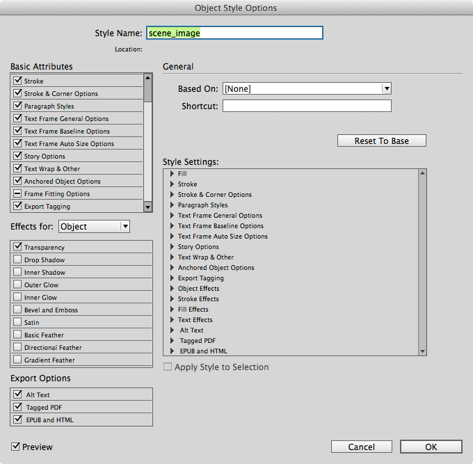
As you will see from this Object Style Options panel, there are many features and attributes that you can set. We are particularly interested in the Export Tagging tab and the Export Options for ‘Alt text’ and ‘ePub and HTML’. The settings here will have significant effect on the output to ePub.


When we use Object Style Options panel, we are setting some generic features of all objects that use this object style. We can also make some specific style changes to each image individually.

### Export Tagging for Objects
In the tag drop down field you will find div and span but because this is a block element rather than inline, we will use div and give this a class name. We can type anything into the tag field, but only some accepted HTML tags will work. We could actually use the HTM5 tag — figure, but not all ePub readers will accept this.

> [!note] 
> I normally give images the _figure_ tag with a class name derived from the style name 

## The ALT text
In the markup language of HTML for the web, images should have some alternative text so that screen readers for people with visual impairment, can read aloud the text description when the image is encountered in the reading order. So, it is with the ePub format. All images should have some ‘ALT text’. Here is what this would look like in the HTML markup:

```html

```

We can add the ALT text in a variety of ways.

### Image Metadata
If we wish to use the ALT text setting in the Object style panel then we will need to extract this text from the metadata held in each image file. This can only work if you have added the metadata for each image.

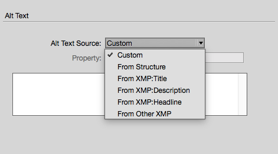

Although you can type some ALT text in the text panel here, this would mean that all images have the same ALT text! This is not acceptable. It is not good practice to use something like ‘Image for the scene’. Using the metadata from each image is the most efficient way, because we can use the Object Style to apply this for all images. Adding metadata for the images can be done with Photoshop under the ‘File Info…’ menu. You can use the title or description fields, but you need to know which to choose in the InDesign ALT text panel.

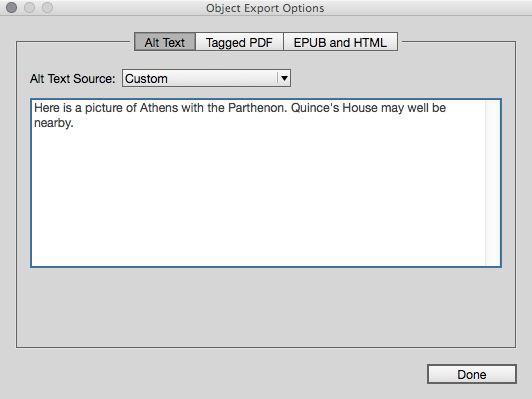

The other way to add the ALT text is to use the ‘Object Export Options’ menu item (under the Object Menu). This method can be used instead of, the above or, we can use it for a particular image where we want to override the Object Style settings.

## The Title Page

Our title page needs special treatment because we have spread out the title, author and sub title down the page, and we want to be sure that this fills the page with no possibility of user changes to font size disturbing this arrangement.

The way to make this happen is to convert the grouped texts into an image. We do this through the Object Export Options Panel, found under the Objects menu.

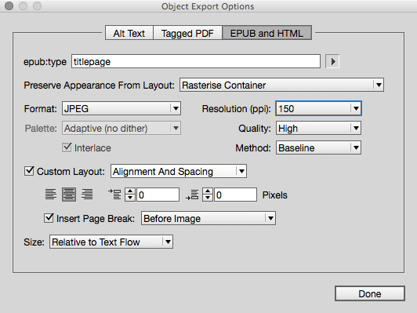

We will invoke this panel after we have grouped all of the objects on this page.

The settings for the Object Export panel are shown here. You can select the correct ePub:type, make sure that you use ‘Rasterise Container’ and also add the ALT text information. Once we have set this up, we will need to make sure that this group is added to the Articles panel in the correct order.

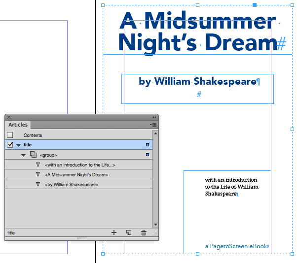

> [!note] 
> I normally select _png_ for the graphic type because this will be transparent in the eBook. If the user uses a reversed colour mode then this will look better.

## The Table of Contents
In our previous work for the print production workflows, we have created a table of contents on the one of the front matter pages. We successfully created the TOC and displayed the items from the structure of the book—the headings, acts and scenes from the play. We displayed the page numbers right aligned with tabs marked with dots. This was appropriate for our print ready PDF, but our ePub version needs something slightly different.

Most eBook reader software will use a structured table of contents within its user interface. In most cases we do not need the TOC to be displayed on the page[^2], because this interactive TOC is a navigation aid available from a drop down menu or in a ‘slide-out’ panel.

In Apple books  on the iPad, the table of contents is displayed in a particular style that we have no control over. In the landscape view on the iPad (seen here) we also have the cover alongside the table of contents.

We have dealt with the details of building a table of contents with InDesign in an earlier help document, so we don’t need to go through this again, but what issues will we encounter when we export to the re-flowable ePub?

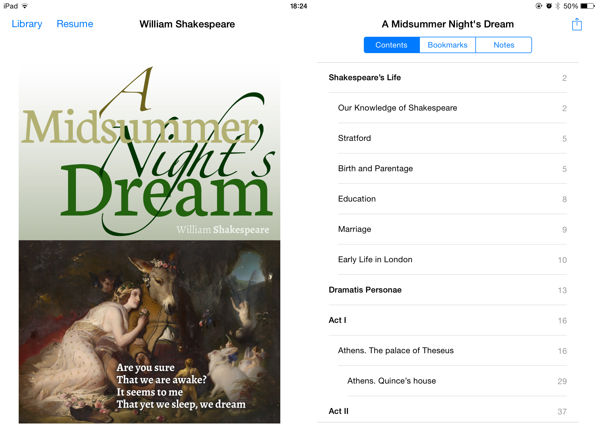

> [!info] 
> This is also how it looks on the Apple Mac since updated in 2020 

By using the table of contents feature, InDesign has already added the structural TOC into the file. All we need to do is to hide this from the page and then choose it by name at the time of export to ePub.

We have two options to hide the ‘on-page’ version of the TOC:

1. We could simply drag the TOC text box to the paste board. Drag it left or right and make sure that no part of the text box is on the page. It will be in the file but NOT on the page.

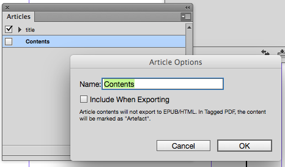

2. A better way though is to set up the whole of our book using the Articles panel. With this method, we simply disable ‘Include when Exporting’ for the ‘Contents’.

We will look further at the Articles panel before we export to the reflowable ePub, because it is with this that we can order the structure.

## The Cover Image
Since we have already created a wrap around cover for the print book, we can use some part of this for the eBook cover. We only need the front part of the cover, not the spine nor the back or flaps. Of course, you might want to use any text you have created for the back of the book somewhere in the front matter, so don’t abandon this altogether.

The cover that I have created for the print book is shown below. This is for a paperback edition with a spine and back. I just need the front for the eBook, so I am going to take the PDF into Photoshop and crop down to a portrait image.
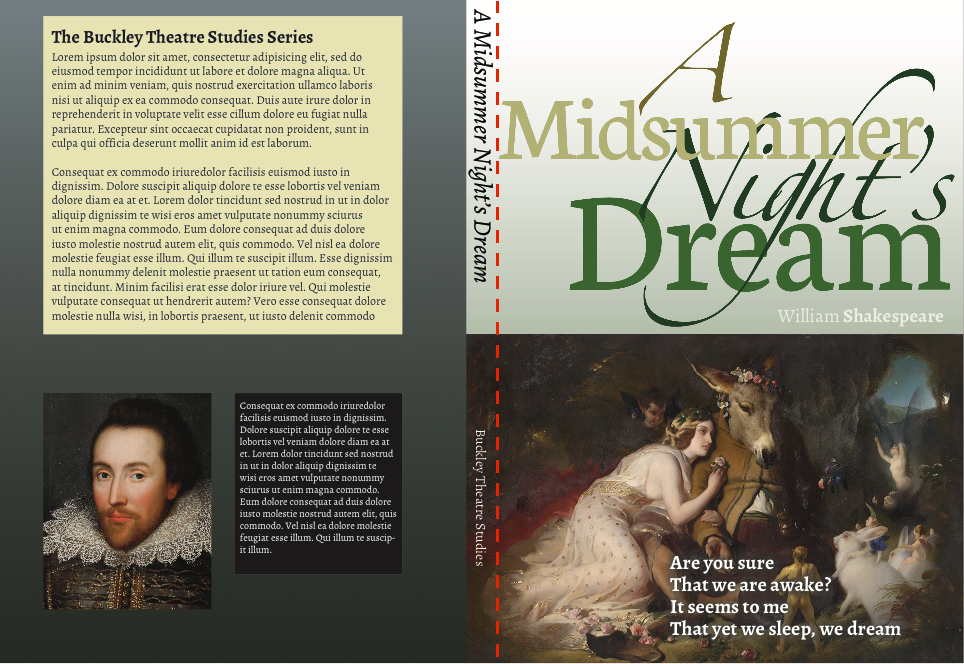

There are certain requirements for this image. If we intend to distribute this eBook through the Apple iBooks store, we need an image that is, at least, 1400pixels on the short side. This is the image that you can put into the ePub, although be sure to keep a copy of this, because distribution systems such as Apple’s or Amazon’s will need this large high quality image for marketing purposes.

In my ‘Midsummer Night’s Dream’ eBook I have cropped the cover in Photoshop and saved as a JPEG image ready to be used when we export to ePub from InDesign. Be sure to know where you have saved this image, because we will need to select it at the time of export to ePub..

The cover is a special image and we have certain issues to consider.

Remember, this cover will be seen as a thumbnail image within the eBook delivery system, so make it clear enough to be read at small sizes. Do not use text that is too small or against a complex background. In my example, I am using the same image from the print edition. You don’t have to do this. Design an eBook version if you prefer.

This eBook will be a portrait format eBook and so the cover should be in the proportion of 6x8 although this is not critical.

Even if the cover is reduced in size for the eBook, keep a larger version available for marketing purposes.

## Book Metadata
Every eBook needs metadata. This can include the title, description, publication date, copyright information and so on. When we export the ePub (reflowable), there is a panel to add this information and we will look at this when we go through the export options later.

Even before we get to this point, we can add this metadata information in InDesign, through the File Info… section under the File menu. However, we are using the book panel, so, the question is, where should we enter this information? Which of the section documents? The book panel does not provide metadata input for the whole book!

It turns out that if we enter the metadata information in the File Info… section *for the InDesign file that is set as the style source*, then it is the information in this file that is used for the metadata in the ePub!

Save the InDesign File, but be sure to save with no spaces in the name. Use underscores or just save using CamelCase.

We will add further metadata to the ePub when we export to ePub.

## Getting Ready to Export

We are probably ready to export to ePub(reflowable) now, but let us just recap on a few things so we don’t get any nasty surprises. And, by the way, we don’t ruin anything when we export. We can always keep trying and overwrite previous versions of the ePub!

### What features are lost when we export the ePub?
There are some aspects of our work for the print version of this book, that will not be carried over to the reflowable ePub. I am going to list them here with a little explanation.

- **Master pages** Anything on the master pages such as the page numbers and the headers will be ignored.
- **Margins** If you have set different margins for left and right pages in a spread, these are ignored. The eBook will be created so that each page is the same.
- **Columns** These will be ignored. The reflowable eBook can only have one column.
- **Alignment to the Baseline Grid** This will be ignored, so you are advised to be sure to set leading for all of your paragraph styles and test these by turning off the Align to Grid option temporarily. The line spacing (leading) in the ePub will only come from the leading setting NOT to the baseline grid.
- **Advanced Character Formats** Any settings for the character or paragraph styles here will be ignored, so if you have set a Baseline Shift, then you may be disappointed that this is not available in the ePub. It may be possible later to add some CSS style rules to simulate this.
- **Paragraph Rules** If you are using a line above or below (or in any other place), this will be ignored in the ePub. We can add this back in using a border in the CSS. More on this later. If you use the underline rather than rule, this will appear in the ePub, but without any offset or colour change.
- **Footnotes** This won’t be ignored and we can use these to create ‘popup’ notes.
- **Orphans and Widows** These are controlled using the Keep Options and they will not be ignored, however, the concept of orphans and widows is not supported by any eReader software that we know currently. The Keep Options panel also controls when a style starts on a new page. This will be used to force a new page, but not all systems support this feature. More on this later.
- **Text wrap** If you have text wrapping around a shaped object, then this feature will be lost. In my book I have a portrait of Shakespeare in an oval shape with the edge of the text following the curve. Our eBook version simply stops the text either side of this image.
- **And more...** I am sure there will be other aspects that will surprise you such as any tabs that will disappear in the ePub!


## Prepare the Styles for Export
We have looked already at how we can add tags and class names to the styles. We must be sure to do this before we export.

One handy way to make sure of these is by using the Edit All Export Tags… feature that can be found in the drop down context menu of the paragraph styles palette.

## Chunking the eBook

The ePub package consists of a number of HTML documents, and for our example we want one separate HTML file for each of our Scenes in the play. We have already simulated this in InDesign, by styling some of the headings to start on the next odd page (see this in a previous section).

If we are using the book panel and have different sections as separate InDesign files; Title, Contents, Introduction, Play —then these will become separate HTML files inside the ePub, when we export. Therefore those sections will always start on a new page.

For each of our heading styles inside these sections, we need to tell InDesign to ‘__Split Document__’ under the Export Tagging tab of the style palette.  

The ‘Export tagging’ panel is where we set up the HTML tags for each of the paragraph, character and object styles. We can configure these setting for each style in turn. We can also conveniently, use the ‘Edit All Export Tags’ panel to configure all of these in one place.

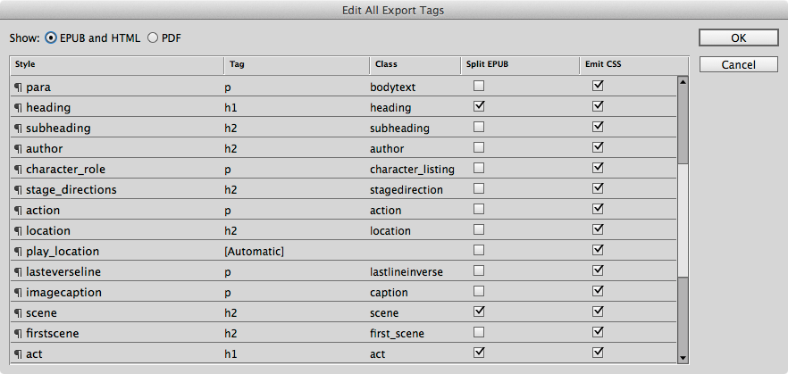

As you can see here, we have given all of the various elements such as verse, prose, act and scene a tag and added our own class names that identify their meaning in the structure of our play or introduction.

## From Book to ePub (re-flowable)

If you are following along from the previous print workflows, then you will be using the book panel to organise your InDesign sections. If you are using the book panel, you should export to ePub and then choose the correct format - ePub(re-flowable).

The dialogue box for the re-flowable ePub has several sections and you need to pay attention to each of these in turn.

If you have Adobe Digital Edition software then this may be the default ePub viewer. You can use other ePub viewer software to review your work. MAC users with OSX version 9 and above can use iBooks to view the eBook. Apple iBooks will be our default, since we are working with a MAC.

If you have an iPad, you can view the eBook with iBooks on that device. We will discuss getting the eBook onto your devices later.

The viewer apps can be set up in the final panel when you export the ePub (re-flowable).

## Export to ePub
Now follows instructions for each of the sections of the export to ePub (reflowable). When you make changes to these settings, they will stay with the file, so you don’t need to fill in the details again each time you export.

### The General Section

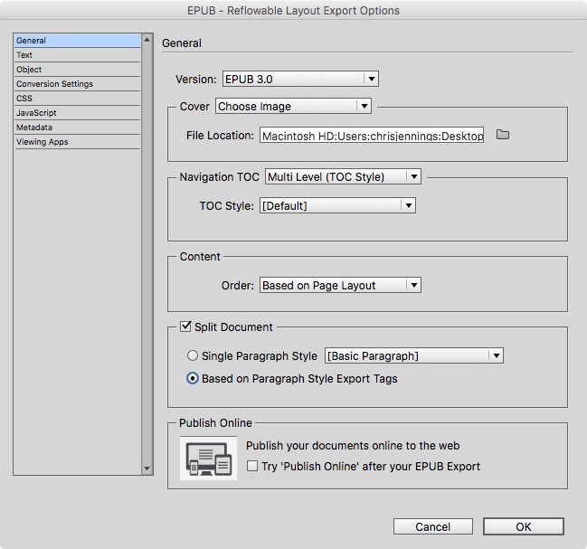

Select `EPUB3.0` we are using the most recent version of the ePub standard.

We should select the cover from the graphic made earlier. This should be a JPEG - not a Photoshop file.

Choose the TOC style from the one we made for our print version. You may find that your saved TOC is not listed, this is because you may have saved it in a different document from the Style source. The solution is to change the style source to the file that contains the TOC. If you haven't explicitly saved with a name, then you will only have `default`.

**Content Same as Articles Panel**. This is the best option for us, because we have arranged our content in the Articles panel, and even turned off the page based Table of Contents, so that it doesn’t show on the page.

We want to _Split Document_ based on the Paragraph Style Export Tags. This is so that we can control exactly where the ePub is split into the separated HTML documents. This is often referred to as ‘chunking’.

### The Text Section
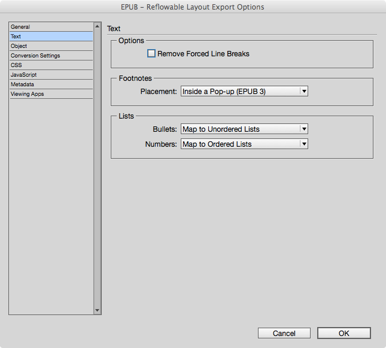

If we have used footnotes in our book then these would normally be delivered at the bottom of each page. Here is a sample of what this looks like in InDesign.

If we choose _Inside a Pop-up (EPUB3)_ then we should get a hyperlinked elevated number in the text which will then produce a popup window with the text of our footnote. We may need to make some adjustments later to the style of the numbered reference in the text.

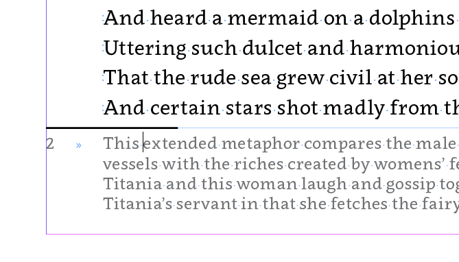

### The Object Section

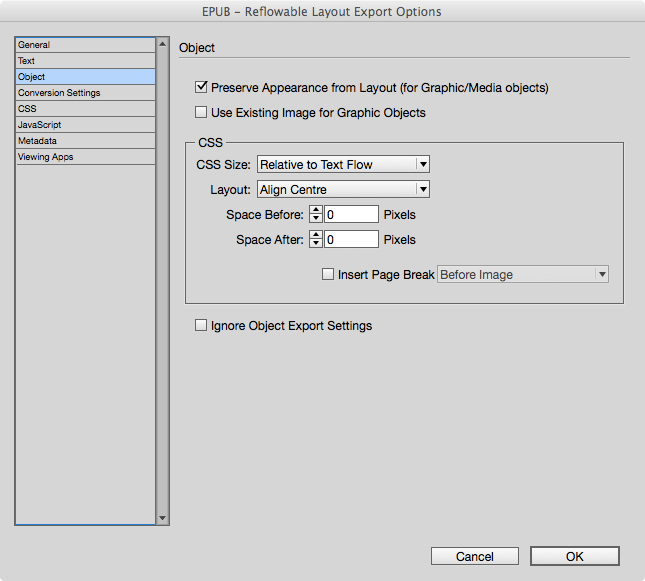

You might prefer to experiment with some of these settings for yourself, but here are my suggestions

Use preserve Appearance from Layout, so the images will take on the style and approximate size that you have given them.\ When you view your eBook in some software and devices, you can enlarge the image by double tapping. The image file inside the ePub needs to be big enough for this to work, so make sure that your originals are at least 1200pixels wide or tall.

Use ‘Relative to Text Flow’\ What this really means is - resize to fit the space; if we view the eBook in a smaller device or window, then the image should be smaller relative to the overall space.\ The alternative is ‘Fixed’ and this may give us display problems on some devices.

We can Align the images left, right or Centred. However, when aligning left or right, the text will flow around the image and—in some situations this can restrict the text to very narrow widths and produce awkward spacing.

It is possible to add a page break automatically after or before an image (or even for both!)

### The Conversion Settings

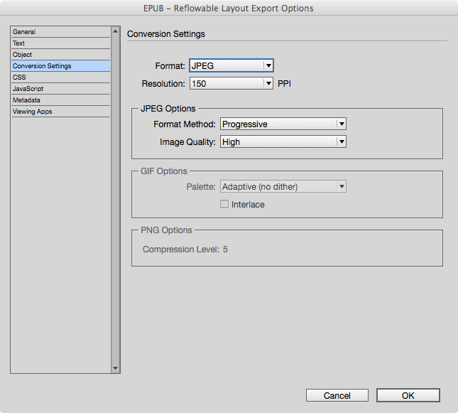

We can choose the way that InDesign converts the images inside the ePub file.

In this example I have opted to use the JPEG file format, although you can just use the automatic setting or PNG. With the JPEG setting you have more options for reducing the file size by reducing the quality. This setting really needs your full attention and please experiment, so that you can build an eBook that has superb images but is not too big overall. Users will not be happy if they need to wait a long time to download you eBook. The Medium or High quality is probably going to be good enough if you have a lot of images. On the other hand use the Maximum quality if you analyse a few images.

If your images use transparency (such as blended shadows or colour overlays), then you should choose PNG. Be aware, though that not all devices support transparency.

Later on we will learn how to unpack the ePub and modify the images to reduce the amount of space that they take up in the ePub package.

### The CSS panel

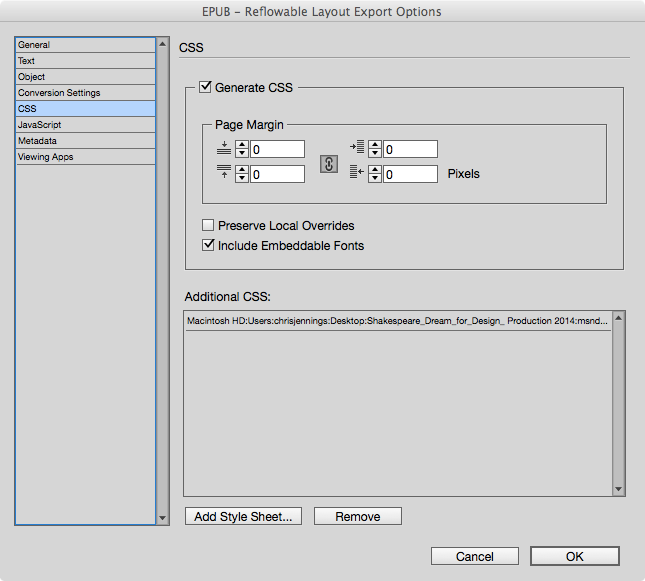

If you don’t know what we mean by CSS, then you should grab some information from the web or get one of the many books on the subject, but essentially…
- CSS means Cascading Style Sheets and is the associated language that goes along with markup languages such as HTML to apply styles to the elements used in the structure of the content.
- When we export to ePub, the various styles (paragraph, character and object) need to be converted to these CSS rules. The ePub format uses HTML and CSS inside the package—you knew that of course
- Do you remember, that we have set the Export Tagging for each style? This is where we get to use these tags. So, we need to check the box ‘Generate CSS’. We can optionally add a margin around the content.
- As you will notice you can also turn on or off the local overrides; if you have specifically selected some text and made the style different without applying a style, then InDesign will create a new tag and CSS to try to match your design style. I suggest that you try to avoid using overrides, but this is where you get a second chance to turn them off!
- **Embedding Fonts** This is whole topic that deserves a separate chapter, but you can opt to include embeddable fonts in the ePub. Some font vendors disable the ability to embed fonts, so you may get a warning if embedding is prevented.
- **Additional CSS** Optionally we can add our own CSS file. The idea here is that this will be linked in the head of each XHTML file in the ePub3 package. Currently version 10.1 of InDesign puts this file before the InDesign generated one. This is wrong—it should come after so you can override some of the style rules that InDesign creates.

### The Javascript Panel

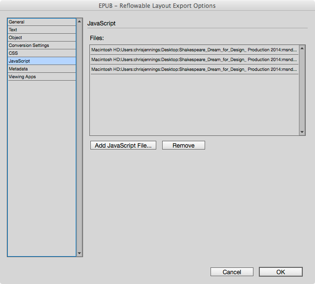

There are some situations where you might want to add javascript to the ePub package. In the example here I have added jQuery and some other routines that help with the display of certain styles.

Using javascript inside the eBook is certainly an advanced topic and you should know that it will have very limited support apart from the Apple iBook software where javascript can be used to great effect on the iPad.

### The Metadata Panel


Every eBook must have certain information stored within the package before it can be published. It is essential that all of the fields provided in this panel are completed. If you don’t yet have an ISBN for the eBook, you can use the random identifier that has been added automatically.

Most of these entry fields are self explanatory but the date field will need a special format.

The date must be in the form shown: Year-Month-Day, in numerals like this:

`2015-01-23`

> [!important] 
> I suggest that you leave InDesign to enter this date for you. 

Some further Metadata is added to the eBook automatically:

- Modified date comes from the time that you exported the ePub
- Language will come from the Dictionary setting in InDesign. This is a generic setting for the whole book, but paragraph and character styles can have different language settings as well, so the metadata can be overridden within the ePub.
- Cover will be generated when you selected the cover image

## You have an ePub; How does it look?
The final panel ‘Viewing Apps’ gives you an opportunity to set your default eReader software. If you are using the MAC then this could be iBooks. Adobe Digital Editions could also be a choice, but, remember, you should test your ePub in a number of environments if possible.

Hopefully, your eReader will show you a cover image and you will be able to observe the table of contents. You may not be happy with some aspects of the visual appearance and so we will now need to make some changes to the CSS that controls the typography and layout.

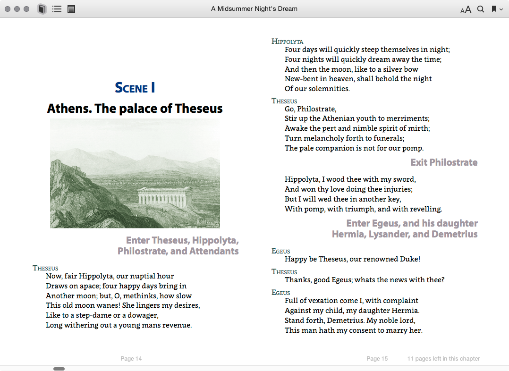

You will notice in this view with Apple’s iBooks, we seem to have lost the heading for the Act — above Scene 1. This is because we used a white text against a deep offset grey rule with InDesign. This does not get converted to any supported CSS, so we will need to add this back with a background for the style of this heading. We do this with ur very own CSS file like this:

```css
h1.act {
background: silver;
}
```


### Blank Pages
You may also experience blank pages in the eBook. This is because we have 2 mechanisms that have effected where the pages break. We have a style for the Acts and Scenes that starts on the next odd page and we have also _split_ the eBook by creating a new HTML file for each section. We can easily resolve this by editing the CSS inside the ePub. Here is what would need:


```css
h1.act, h2.scene {
page-break-after:auto;
page-break-before:auto;
}
```

The next help document will focus on how we can edit the insides of the ePub file and what changes we can make to the styles and other view settings.

[Editing inside the ePUB package](Editing%20inside%20the%20ePUB%20package.md)

[^1]: There is a project to develop a hybrid ePub format that will allow the mixture of re-flowable and fixed-layout pages. If you want to explore this further then you should go to the [International Digital Publishing Forum ](http://idpf.org/epub/31 "EPUB 3.1 - International Digital Publishing Forum")web site. The IDPF has now merged with the W3 organisation.

[^2]: If we plan to convert the ePub to the Kindle MOBI format then we may need to display a table of contents somewhere. This is because the Amazon recommend this for their format. However, we can find other ways of resolving this. A topic to be addressed later.